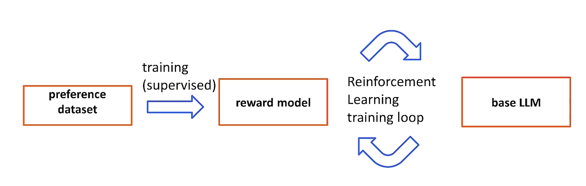
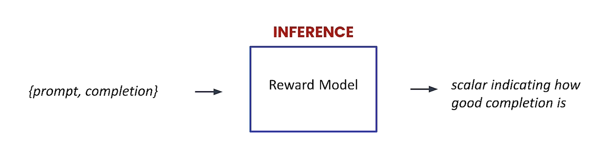
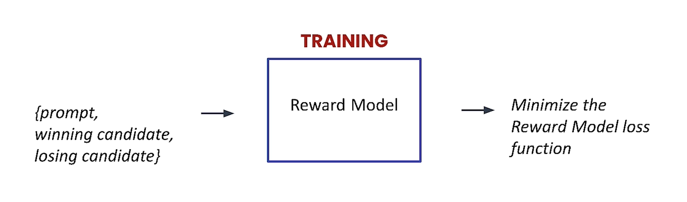
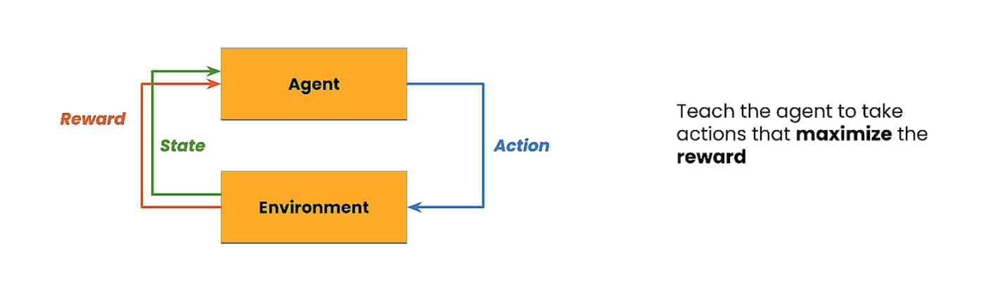
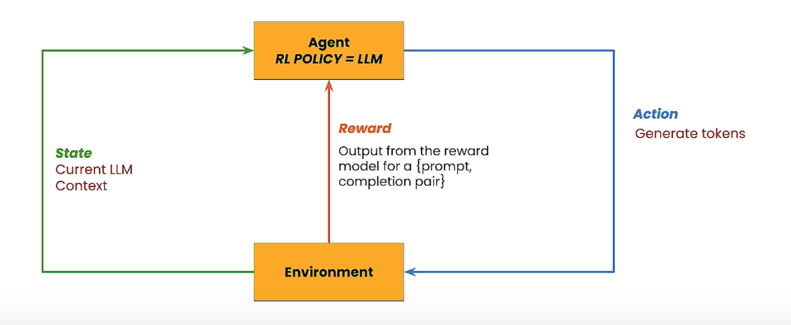
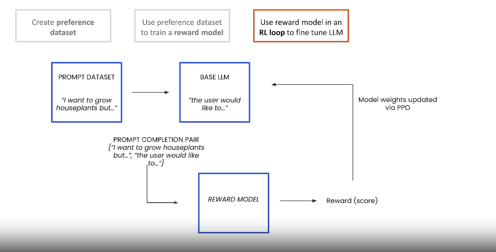
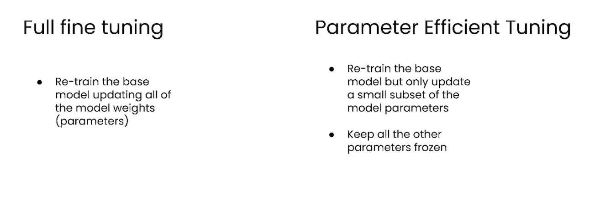

# RLHF Working

- Natural language is flexible
- There is no best answer
- We can gather human preferences
- We can output multiple answers and then ask the labeller which one to prefer

## STEPS

## REWARD MODEL

- 

- 

## FINE TUNE LLM

## Parameter Efficient Fine Tuning

---
